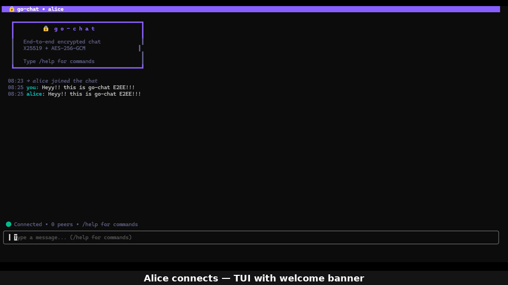

# go-chat

A **real-time terminal chat application** built from scratch in Go, featuring true **End-to-End Encryption**. Every private message is encrypted on the sender's device using X25519 key exchange and AES-256-GCM, meaning the server is cryptographically unable to read message content — it only **routes** ciphertext between peers.



The project implements a custom length-prefixed protocol over TLS, a goroutine-per-connection server with channel-based message routing, and a polished terminal UI built with Bubbletea. No third-party crypto dependencies — only the Go standard library and `x/crypto`.

## Features

- **End-to-End Encryption** — X25519 key exchange + AES-256-GCM
- **TLS Transport** — All connections encrypted with TLS 1.3
- **Terminal UI** — Built with [Bubbletea](https://github.com/charmbracelet/bubbletea) + [Lipgloss](https://github.com/charmbracelet/lipgloss)
- **Private Messaging** — Encrypted 1-to-1 messages
- **Broadcast Chat** — Group messages to all connected users
- **Key Synchronization** — Late joiners automatically receive existing public keys

## Architecture

```
┌──────────────────┐                         ┌──────────────────────────┐
│     Client A     │       TLS/TCP           │         Server           │
│                  ├────────────────────────►│                          │
│  • Keypair gen   │                         │  • Message routing       │
│  • Encrypt msgs  │                         │  • Public key registry   │
│  • Decrypt msgs  │                         │  • User management       │
│  • Terminal UI   │                         │  • Never sees plaintext  │
└──────────────────┘                         └──────────────────────────┘
                                                        ▲
┌──────────────────┐       TLS/TCP                      │
│     Client B     ├────────────────────────────────────┘
│                  │
│  • Keypair gen   │
│  • Encrypt msgs  │
│  • Decrypt msgs  │
│  • Terminal UI   │
└──────────────────┘
```

## Security Model

| Layer | Protects Against | Technology |
|-------|-----------------|------------|
| TLS | Network eavesdroppers, MITM | crypto/tls, X.509 certificates |
| E2EE | Compromised server, server operator | X25519 + AES-256-GCM |
| Length-prefixed framing | Message injection, parsing bugs | encoding/binary |
| Message size limits | Memory exhaustion | 64KB max payload |

**What the server knows:** Who is online, who is talking to whom, message sizes and timing.

**What the server cannot know:** Message content — encrypted with keys the server never possesses.

## Quick Start

### Prerequisites

- Go 1.21+

### Build

```bash
# Generate TLS certificates
make certs

# Build server and client
make build
```

### Run

**Linux / WSL:**
```bash
# Start the server
./bin/server

# In other terminals, start clients
./bin/client
./bin/client --name alice
./bin/client --addr 192.168.1.50:9000
```

**Windows (PowerShell):**
```powershell
# Build Windows binaries
go build -o bin/server.exe ./cmd/server
go build -o bin/client.exe ./cmd/client

# Start the server
.\bin\server.exe

# In other terminals, start clients
.\bin\client.exe
.\bin\client.exe --name alice
.\bin\client.exe --addr 192.168.1.50:9000
```

### Server Flags

| Flag | Default | Description |
|------|---------|-------------|
| `--port` | `9000` | Server listen port |
| `--cert` | `certs/server.crt` | TLS certificate path |
| `--key` | `certs/server.key` | TLS private key path |

### Client Flags

| Flag | Default | Description |
|------|---------|-------------|
| `--addr` | `localhost:9000` | Server address |
| `--name` | _(prompted)_ | Username |

## Commands

| Command | Description |
|---------|-------------|
| `/msg <user> <text>` | Send an encrypted private message |
| `/users` | List online users |
| `/help` | Show available commands |
| `/quit` | Disconnect and exit |
| `Ctrl+C` / `Esc` | Exit |

## Project Structure

```
go-chat/
├── cmd/
│   ├── server/main.go       # Server entry point
│   ├── client/main.go       # Client entry point
│   └── gen-cert/main.go     # TLS certificate generator
├── internal/
│   ├── protocol/            # Message types, encoding/decoding
│   ├── crypto/              # Key generation, encryption, decryption
│   ├── server/              # Hub (routing) + per-connection handler
│   └── client/              # Bubbletea TUI
├── certs/                   # Generated TLS certificates (gitignored)
├── Makefile
└── README.md
```

## How E2EE Works

```
1. Client generates X25519 keypair on startup
2. Public key is sent to server and distributed to all peers
3. To send a private message to Bob:
   a. Alice computes: shared_secret = X25519(alice_private, bob_public)
   b. Derives AES key: SHA-256(shared_secret)
   c. Encrypts with AES-256-GCM (random nonce per message)
   d. Sends ciphertext — server routes it without reading
4. Bob computes the same shared secret and decrypts
```

## Testing

```bash
make test
```

Tests cover:
- Encrypt → decrypt round-trip
- Shared secret symmetry (A→B == B→A)
- Wrong key rejection
- Nonce uniqueness (same plaintext produces different ciphertext)
- Protocol encode → decode round-trip
- Truncated/malformed message handling

## Tech Stack

- **Language:** Go
- **Transport:** TCP + TLS
- **Encryption:** X25519 (key exchange) + AES-256-GCM (message encryption)
- **TUI:** Bubbletea + Lipgloss + Bubbles
- **Protocol:** Length-prefixed JSON envelopes
- **Logging:** log/slog (structured)

## License

MIT
